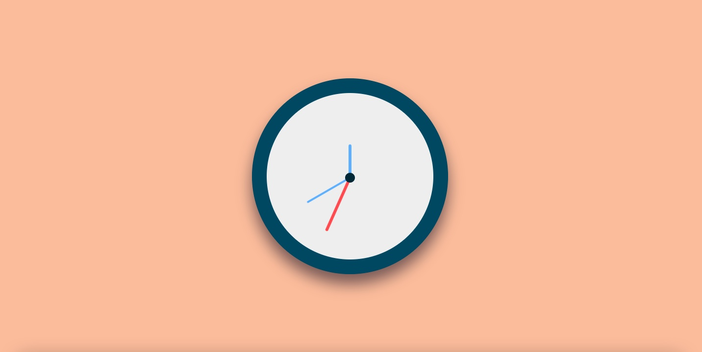

# CSS + JS Clock

## General Info

An analog clock created with CSS and JavaScript.

Click [here](https://marekjanik.github.io/clock/) to watch it live.

## Technologies

This project is built with Vanilla JavaScript.

## HTML

The HTML structure is based on div elements which are created to hold the clock, clock face and clock hands.

## CSS

All elements are positioned in the middle of the page using Flexbox.

The clock hands are absolutely positioned and relative to the clock face.

A dial in the center of the clock is created with `::after` pseudo-element of the `.clock-face` element.

The `.clock-face::after` pseudo-element has 3px added in `transform: translate(-50%, calc(-50% + 3px))` to account for the height of the clock hands.

The clock hands are rotated 90 degrees to set their initial position at 12:00. A transition of 0.05 seconds is applied in readiness for the change of position via JavaScript.

To prevent the clock hands from rotating from their center (which is the default and in most cases a preffered behaviour), `transform-origin: 100%` is used to set the rotating point from the right side.

The `transition-timing-function` is applied to create a more realistic tick effect. The use of `cubic-bezier` forces the clock hands to jump forward slightly and reset with every tick, much like the motion of an actual clock.

## JavaScript

At first, variables are created and declared storing the individual clock hands.

The `setDate()` function is declared, which:

- creates a new `Date` object and assigns it to the variable `now`,
- gets the current values ​​of time units from the created `Date` object and assigns them to the variables `seconds`, `minutes` and `hours`,
- converts `seconds`, `minutes` and `hours` into degrees and assigns them to the corresponding variables. Seconds and minutes are divided by 60 (hours by 12) to get the percentages and then multiplied by 360 to get the corresponding degrees. 90 is added to each result because of the `transform: rotate (90deg)` applied in the CSS,
- rotates the clock hands by the value of the calculated degrees by setting the style transform,
- to prevent a bug where the clock hands move backwards to reset when reaching 90 degrees, an `if` statement is declared which checks the current degree of each hand and modify the style transition.

Finally, the `setDate()` function is called every 1 second with the `setInterval()` method.

## Things I Have Learned

| Syntax                | Description                                                                |
| --------------------- | -------------------------------------------------------------------------- |
| new Date()            | Returns the current Date object                                            |
| getSeconds()          | A JavaScript method to get the current value of seconds from a Date object |
| getMinutes()          | A JavaScript method to get the current value of minutes from a Date object |
| getHours()            | A JavaScript method to get the current value of an hour from a Date object |
| (seconds / 60) \* 360 | An angle representation of seconds in an analog clock                      |
| (minutes / 60) \* 360 | An angle representation of minutes in an analog clock                      |
| (hours / 12) \* 360   | An angle representation of hours in an analog clock                        |

## Sources

This project is based on [#JavaScript30](https://javascript30.com/) coding challenge by Wes Bos.
